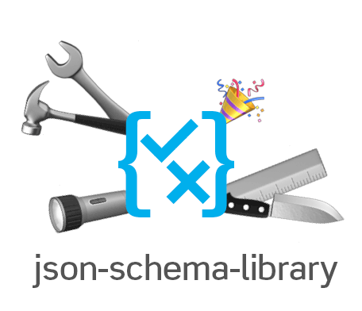

<p align="center"></p>

**Customizable and hackable json-validator and json-schema utilities for traversal, data generation and validation**

> This package offers tools and utilities to work with json-schema, create and validate data. Unfortunately, most
> packages, editors or validators do not care to expose basic json-schema functionality. Instead of small memory
> footprint or high performance, this package focuses on exposing utilities for browser and node environments and
> lessens the pain to build custom tools around json-schema.

> ⚠️ This documentation refers to the upcoming release version 10, which can be installed by `npm install json-schema-library@10.0.0-rc1`. For the latest release please refer to the [documentation of version 9.3.5](https://github.com/sagold/json-schema-library/tree/v9.3.5)

<p style="text-align:center">
  <a href="#draft-methods">draft methods</a> | <a href="#draft-extensions">draft extensions</a> | <a href="#draft-customization">draft customization</a> | <a href="#breaking-changes">breaking changes</a>
</p>

**install**

`yarn add json-schema-library`

[](https://github.com/sagold/json-schema-library/actions/workflows/ci.yaml)
[](https://github.com/sagold/json-schema-library/actions/workflows/ci.yaml)

This library currently supports draft4, draft6, draft7 and draft2019-09 features [@see benchmark](https://github.com/sagold/json-schema-benchmark)

**usage**

`json-schema-library` exposes a `Draft` for most json-schema drafts. Each `Draft` can be instantiated and offers a common set of actions working on the specified json-schema version. Example:

```ts
import { Draft04, Draft06, Draft07, Draft2019, Draft, JsonError } from "json-schema-library";
import myJsonSchema from "./myJsonSchema.json";
import myData from "./myData.json";

const jsonSchema: Draft = new Draft2019(myJsonSchema);
const errors: JsonError[] = jsonSchema.validate(myData);
```

What follows is a description of the main draft methods.

## Draft support

`json-schema-library` supports almost all draft features. This sections lists currently unsupported features for each draft

<details><summary>Draft 2019-09</summary>

**Currently unsupported core features:**

-   `$vocabulary` - meta-schemas are not parsed for enabled features
-   `unevaluatedItems: uncle-schema` - evaluation of uncle-schemas is not supported. Properties will be return as evaluated
-   `unevaluatedProperties: uncle-schema` - evaluation of uncle-schemas is not supported. Properties will be return as evaluated

For further details see [draft2019-09 tests](https://github.com/sagold/json-schema-library/blob/main/test/spec/v2019-09/draft2019-09.test.ts)

</details>

## Draft methods

-   [validate](#validate)
-   [isValid](#isvalid)
-   [validateAsync](#validateasync)
-   [getTemplate](#gettemplate)
-   [each](#each)
-   [eachSchema](#eachschema)
-   [getSchema](#getschema)
-   [getChildSchemaSelection](#getchildschemaselection)
-   [step](#step)
-   [addRemoteSchema](#addremoteschema)
-   [createSchemaOf](#createschemaof)
-   [compileSchema](#compileschema)

### validate

`validate` is a complete _json-schema validator_ for your input data. Calling _validate_ will return a list of validation errors for the passed data.

```ts
const jsonSchema = new Draft2019(myJsonSchema);
const errors: JsonError[] = jsonSchema.validate(myData);
```

Additionally, you can validate a sub-schema and its data. Doing this, the intial schema will be used as rootSchema (for example, to resolve `$ref` from _definitions_).

```ts
const jsonSchema = new Draft2019(myJsonSchema);
const errors: JsonError[] = jsonSchema.validate("my-string", { type: "number" });
```

> To prevent some errors when using helper methods with an independent sub-schema, please use `compileSchema` if it is not retrieved from a draft-method directly (which was compiled by passing it to Draft). Specifically, if the schema contains a $ref you need to use `compileSchema`. More details in [compileSchema](#compileSchema).

<details><summary>About type JsonError</summary>

In `json-schema-library` all errors are in the format of a `JsonError`:

```ts
type JsonError = {
    type: "error";
    name: string;
    code: string;
    message: string;
    data?: { [p: string]: any };
};
```

In almost all cases, a _json-pointer_ is given on _error.data.pointer_, which points to the source within data where the error occured.

For more details on how to work with errors, refer to section [custom errors](#custom-errors).

</details>

<details><summary>Example</summary>

```ts
import { Draft2019, JsonSchema, JsonError } from "json-schema-library";

const myJsonSchema: JsonSchema = {
    type: "object",
    additionalProperties: false
};

const jsonSchema = new Draft2019(myJsonSchema);
const errors: JsonError[] = jsonSchema.validate({ name: "my-data" });

expect(errors).to.deep.equal([
    {
        type: "error",
        name: "NoAdditionalPropertiesError",
        code: "no-additional-properties-error",
        message: "Additional property `name` in `#` is not allowed",
        data: { property: "name", properties: [], pointer: "#" }
    }
]);
```

</details>

<details><summary>Example with separate schema</summary>

```ts
import { Draft2019, JsonSchema, JsonError } from "json-schema-library";

const myJsonSchema: JsonSchema = {
    type: "object",
    additionalProperties: false
};

const jsonSchema = new Draft2019(myJsonSchema);
const mySchema = jsonSchema.compileSchema({ type: "number" });
const errors: JsonError[] = jsonSchema.validate("my-string", mySchema);

expect(errors).to.deep.equal([
    {
        type: "error",
        name: "TypeError",
        code: "type-error",
        message: "Expected `my-string` (string) in `#` to be of type `number`",
        data: {
            received: "string",
            expected: "number",
            value: "my-string",
            pointer: "#"
        }
    }
]);
```

</details>

### isValid

`isValid` will return `true` if the given json-data is valid against the json-schema.

```ts
const jsonSchema = new Draft2019(myJsonSchema);
const isValid: boolean = jsonSchema.isValid(myData);
```

### validateAsync

> This method is not yet exposed by a draft directly as the API of this is yet unsatisfactory. Nonetheless, this function is in production and can be used reliably.

Optional support for `onError` helper, which is invoked for each error (after being resolved):

```ts
import { Draft2019, JsonError, validateAsync } from "json-schema-library";

const draft = new Draft2019(mySchema);

validateAsync(draft, "", { onError: (err: JsonError) => {}, schema: draft.getSchema() }).then(
    (allErrors: JsonError[]) => {}
);
```

### getTemplate

`getTemplate` creates input data from a json-schema that is valid to the schema. Where possible, the json-schema `default` property will be used to initially setup input data. Otherwise, the first values encountered (enum values, initial values, etc.) are user to build up the json-data.

```ts
const jsonSchema = new Draft2019(myJsonSchema);
const myData = jsonSchema.getTemplate();
```

Additionally, you can pass input data. `getTemplate` will then complement any missing values from the schema, while keeping the initial values.

```ts
const jsonSchema = new Draft2019(myJsonSchema);
const myData = jsonSchema.getTemplate({ name: "input-data" });
```

**Note** If you are using references in your schema, `getTemplate` will only resolve the first _$ref_ in each path, ensuring no inifinte data structures are created. In case the limit of **1** _$ref_ resolution is too low, you can modify the value globally one by adjusting the json-schema-library settings:

```ts
import { settings } from "json-schema-library";
settings.GET_TEMPLATE_RECURSION_LIMIT = 5;
```

<details><summary>Example</summary>

```ts
import { Draft2019, JsonSchema } from 'json-schema-library';

const myJsonSchema: JsonSchema = {
  type: 'object',
  required: ['name', 'option', 'list'],
  properties: {
    name: { type: 'string' },
    option: {
      type: 'string',
      enum: ['first-option', 'second-option']
    },
    list: {
      type: 'array',
      items: {
        type: 'string',
        default: 'new item'
      },
      minItems: 1
    }
  }
};

const jsonSchema = new Draft2019(myJsonSchema);
const myData = jsonSchema.getTemplate();

expect(myData).to.deep.equal({
  name: ',
  option: 'first-option',
  list: ['new item']
});
```

</details>

<details><summary>Example with input data</summary>

```ts
import { Draft2019, JsonSchema } from "json-schema-library";

const myJsonSchema: JsonSchema = {
    type: "object",
    required: ["name", "option", "list"],
    properties: {
        name: { type: "string" },
        option: {
            type: "string",
            enum: ["first-option", "second-option"]
        },
        list: {
            type: "array",
            items: {
                type: "string",
                default: "new item"
            },
            minItems: 1
        }
    }
};

const jsonSchema = new Draft2019(myJsonSchema);
const myData = jsonSchema.getTemplate({ name: "input-data", list: [] });

expect(myData).to.deep.equal({
    name: "input-data",
    option: "first-option",
    list: ["new item"]
});
```

</details>

<details><summary>Option: extendDefaults</summary>

Per default, `getTemplate` does try to create data that is valid to the json-schema. Example: array-schemas with `minItems: 1` will add one item to fullfil the validation criteria. You can use the option and pass `{ extendDefaults: false }` to override this behaviour with a default value:

```ts
import { Draft2019 } from "json-schema-library";

const myJsonSchema = {
    type: "array",
    default: [], // if omitted will add an array item
    items: {
        type: "string",
        enum: ["one", "two"]
    },
    minItems: 1 // usually adds an enty, but default states: []
};

const jsonSchema = new Draft2019(myJsonSchema);
const myData = jsonSchema.getTemplate(undefined, undefined, { extendDefaults: false });

expect(myData).to.deep.equal([]);
```

</details>

### each

`each` iterates over each data-item (_object_, _array_ and _value_) and emits the data-item, schema and location to a callback.

```ts
const jsonSchema = new Draft2019(mySchema);
const myCallback = (schema: JsonSchema, value: unknown, pointer: JsonPointer) => {
    console.log(schema, value, pointer);
};
jsonSchema.each(myData, myCallback);
```

<details><summary>Example</summary>

```ts
import { Draft2019, JsonSchema, JsonPointer } from "json-schema-library";

const mySchema: JsonSchema = {
    type: "array",
    items: [{ type: "number" }, { type: "string" }]
};

const jsonSchema = new Draft2019(mySchema);
const calls = [];
const myCallback = (schema: JsonSchema, value: unknown, pointer: JsonPointer) => {
    calls.push({ schema, value, pointer });
};

jsonSchema.each([5, "nine"], myCallback);

expect(calls).to.deep.equal([
    { schema: mySchema, value: [5, "nine"], pointer: "#" },
    { schema: { type: "number" }, value: 5, pointer: "#/0" },
    { schema: { type: "string" }, value: "nine", pointer: "#/1" }
]);
```

</details>

### eachSchema

`eachSchema` emits each sub-schema definition to a callback.

```ts
const jsonSchema = new Draft2019(mySchema);
const myCallback = (schema: JsonSchema) => {
    console.log(schema);
};
jsonSchema.eachSchema(myCallback);
```

<details><summary>Example</summary>

```ts
import { Draft2019, JsonSchema } from "json-schema-library";

const mySchema: JsonSchema = {
    type: "array",
    items: {
        oneOf: [{ type: "number" }, { $ref: "#/$defs/value" }]
    },
    $defs: {
        value: { type: "string" },
        object: { type: "object" }
    }
};

const jsonSchema = new Draft2019(mySchema);
const calls = [];
const myCallback = (schema: JsonSchema) => {
    calls.push(schema);
};

jsonSchema.eachSchema(myCallback);

expect(calls).to.deep.equal([
    mySchema,
    { oneOf: [{ type: "number" }, { $ref: "#/$defs/value" }] },
    { type: "number" },
    { $ref: "#/$defs/value" },
    { type: "string" },
    { type: "object" }
]);
```

</details>

### getSchema

`getSchema` retrieves the json-schema of a specific location in data. The location in data is given by a _json-pointer_. In many cases the json-schema can be retrieved without passing any data, but in situations where the schema is dynamic (for example in _oneOf_, _dependencies_, etc.), the data is required or will return a _JsonError_ if the location cannot be found.

```ts
const jsonSchema = new Draft2019(mySchema);
let schemaOfName: JsonSchema | JsonError | undefined;
schemaOfName = jsonSchema.getSchema({ pointer: "/list/1/name", data: myData });
```

**Note** that `getSchema` will return `undefined` for paths that lead to valid properties, but miss a schema definition. For example:

```ts
const jsonSchema = new Draft2019({ type: "object" });
let schemaOfName = jsonSchema.getSchema({ pointer: "/name" });
console.log(schemaOfName); // undefined
```

In case this is unwanted behaviour, use the `withSchemaWarning` option to return a json-error with code `schema-warning` instead:

```ts
const jsonSchema = new Draft2019({ type: "object" });
let schemaOfName = jsonSchema.getSchema({ pointer: "/name", withSchemaWarning: true });
console.log(schemaOfName); // { type: "error", code: "schema-warning" }
```

<details><summary>Example</summary>

```ts
import { Draft2019, JsonSchema, JsonError } from "json-schema-library";

const mySchema = {
    type: "object",
    properties: {
        list: {
            type: "array",
            items: {
                oneOf: [
                    {
                        type: "object",
                        required: ["name"],
                        properties: {
                            name: {
                                type: "string",
                                title: "name of item"
                            }
                        }
                    },
                    {
                        type: "object",
                        required: ["description"],
                        properties: {
                            description: {
                                type: "string",
                                title: "description of item"
                            }
                        }
                    }
                ]
            }
        }
    }
};

const jsonSchema = new Draft2019(mySchema);
let schemaOfItem: JsonSchema | JsonError | undefined;
schemaOfItem = jsonSchema.getSchema({
    pointer: "/list/1",
    data: {
        list: [{ description: "..." }, { name: "my-item" }]
    }
});

expect(schemaOfItem).to.deep.equal({
    type: "object",
    required: ["name"],
    properties: {
        name: {
            type: "string",
            title: "name of item"
        }
    }
});
```

</details>

<details><summary>Evaluating errors</summary>

All returned json-errors have a data property with the following properties

-   `pointer` json-pointer to the location where the error occured. In case of omitted data, this is the last json-schema location that could be resolved
-   `schema` the json-schema of the last resolved location and the source of the error
-   `value` the data value at this location that could not be resolved

```ts
const schema = jsonSchema.getSchema({ pointer: "/list/1" });
if (isJsonError(schema)) {
    console.log(Object.keys(schema.data)); // [pointer, schema, value]
}
```

</details>

<details><summary>About JsonPointer</summary>

**[Json-Pointer](https://tools.ietf.org/html/rfc6901)** defines a string syntax for identifying a specific value within a Json document and is [supported by Json-Schema](https://json-schema.org/understanding-json-schema/structuring.html). Given a Json document, it behaves similar to a [lodash path](https://lodash.com/docs/4.17.5#get) (`a[0].b.c`), which follows JS-syntax, but instead uses `/` separators (e.g., `a/0/b/c`). In the end, you describe a path into the Json data to a specific point.

</details>

### getChildSchemaSelection

`getChildSchemaSelection` returns a list of available sub-schemas for the given property. In many cases, a single schema will be returned. For _oneOf_-schemas, a list of possible options is returned.

This helper always returns a list of schemas.

**Note** This helper currenly supports a subset of json-schema for multiple results, mainly _oneOf_-definitions

```ts
const jsonSchema = new Draft2019(mySchema);
const schemas: JsonSchema[] = jsonSchema.getChildSchemaSelection("content", localSchema);
```

<details><summary>Example</summary>

```ts
import { Draft2019, JsonSchema } from "json-schema-library";

const jsonSchema = new Draft2019();
const localSchema = {
    type: "object",
    properties: {
        content: {
            oneOf: [{ type: "string" }, { type: "number" }]
        }
    }
};

const schemas: JsonSchema[] = jsonSchema.getChildSchemaSelection("content", localSchema);

expect(schemas).to.deep.equal([{ type: "string" }, { type: "number" }]);
```

</details>

### step

`step` retrieves the json-schema of a child property or index. Using `step` it is possible to incrementally go through the data, retrieving the schema for each next item.

@todo talk about `schemaNode`

```ts
const draft = new Draft2019(mySchema);
const localSchema = { type: "object", properties: { title: { type: "string" } } };
const localData = { title: "value" };
const { schema } = draft.step(draft.createNode(localSchema), "title", localData);
```

<details><summary>Example</summary>

```ts
import { Draft2019, JsonSchema } from "json-schema-library";

const draft = new Draft2019(mySchema);
const localSchema: JsonSchema = {
    oneOf: [
        {
            type: "object",
            properties: { title: { type: "string" } }
        },
        {
            type: "object",
            properties: { title: { type: "number" } }
        }
    ]
};
const localData = { title: 4 };
const { schema } = draft.step(draft.createNode(localSchema), "title", localData);

expect(schema).to.deep.eq({ type: "number" });
```

</details>

### addRemoteSchema

`addRemoteSchema` lets you add additional schemas that can be referenced by an URL using `$ref`. Use this to combine multiple schemas without changing the actual schema.

Each schemas is referenced by their unique `$id` (since draft-06, previously `id`). Usually an `$id` is specified as an url, for example `https://mydomain.com/schema/schema-name` or with a file extension like `https://mydomain.com/schema/schema-name.json`. At least in `json-schema-library` you can use any name, just ensure the `$id` is unique across all schemas.

To add a remote schema use the exposed method `addRemoteSchema`:

```ts
const jsonSchema = new Draft2019();

jsonSchema.addRemoteSchema("https://sagold.com/remote", {
    $id: "https://sagold.com/remote",
    title: "A character",
    type: "string",
    minLength: 1,
    maxLength: 1
});
```

**Note** the given _url_ and `$id` on the root schema should match. If `$id` is omitted it will be added from the passed url.

To access the remote schema, add a $ref within your local schema

```ts
jsonSchema.setSchema({
    $id: "https://sagold.com/local",
    type: "object",
    required: ["character"],
    properties: {
        character: {
            $ref: "https://sagold.com/remote"
        }
    }
});
```

and the remote schema will be resolved automatically:

```ts
jsonSchema.validate({ character: "AB" }); // maxLength error
jsonSchema.getTemplate({}); // { character: "A" } - default value resolved
// returns remote schema (from compiled local schema):
jsonSchema.getSchema().getRef("https://sagold.com/remote");
```

**Note** the support for $ref resolution has additional complexities, if you add nested $ids to you schema. Here, json-schema-library has only partial support ([@see integration test result](https://github.com/sagold/json-schema-library/actions/runs/4037856805/jobs/6941448741)). Thus, it is recommended to omit the features of changing scopes by nested $ids. For more details, see [json-schema.org: Structuring a complex schema](https://json-schema.org/understanding-json-schema/structuring.html#base-uri)

<details><summary>Access local subschemas in remote schemas</summary>

You can add a local uri reference to the remote schema by using the `#` separator. The following example resolves hte local path `/$defs/character` in the remote schema `https://sagold.com/remote` throught the combined url:
`https://sagold.com/remote#/$defs/character`

```ts
jsonSchema.addRemoteSchema("https://sagold.com/remote", {
    $defs: {
        character: {
            title: "A character",
            type: "string",
            minLength: 1,
            maxLength: 1
        }
    }
});

jsonSchema.setSchema({
    $id: "https://sagold.com/local",
    $ref: "https://sagold.com/remote#/$defs/character"
});

jsonSchema.validate("AB"); // maxLength error
jsonSchema.getTemplate("A"); // "A" - default value resolved
// returns remote schema (from compiled local schema):
jsonSchema.getSchema().getRef("https://sagold.com/remote#/$defs/character");
```

**Note** json-pointers are not restricted to `$defs` (definitions), but can reference any subschema. For example:

```ts
jsonSchema.addRemoteSchema("https://sagold.com/remote", {
    type: "object",
    properties: {
        character: {
            title: "A character",
            type: "string",
            minLength: 1,
            maxLength: 1
        }
    }
});

jsonSchema.setSchema({
    $id: "https://sagold.com/local",
    $ref: "https://sagold.com/remote#/properties/character"
});

jsonSchema.validate("AB"); // maxLength error
jsonSchema.getTemplate("A"); // "A" - default value resolved
// returns remote schema (from compiled local schema):
jsonSchema.getSchema().getRef("https://sagold.com/remote#/properties/character");
```

</details>

### createSchemaOf

`createSchemaOf` returns a simple json-schema of the input data.

```ts
const jsonSchema = new Draft2019(mySchema);
const schema: JsonSchema = jsonSchema.createSchemaOf({ title: "initial value" });
```

### compileSchema

`compileSchema` adds _$ref_ resolution support to a json-schema. Internally, each draft compiles a passed schema on its own, but when passing additional schemas to individual functions, `compileSchema` has to be called manually for json-schemas containing _$ref_-references.

```ts
const jsonSchema = new Draft2019(mySchema);
const compiledSchema = jsonSchema.compileSchema({ $ref: "/$defs/table" });
const tableSchema = compiledSchema.getRef();
```

**Note** that `draft.compileSchema` compiles a schema under the current rootSchema. That is, definitions from root schema will be copied to the local schema, to enable _$ref_ resolutions.

## Draft extensions

For each draft `json-schema-library` supports the following custom properties:

### patternExample

For error generation, an attribute `patternExample` may be set for a `pattern` validation. Instead of the regular
expression, the example will be printed in the error message.

### oneOfProperty

For `oneOf` resolution, json-schema states that data is valid if it validates against exactly one of those sub-schemas. In some scenarios this is unwanted behaviour, as the actual `oneOf` schema is known and only validation errors of this exact sub-schema should be returned.

For an explicit `oneOf` resolution, the json-schema may be extended by a property `oneOfProperty`. This will always associate an entry with a matching value (instead of schema validation) and return only this schema or validation errors, depending on the current task. For example:

```ts
const schema = {
    oneOfProperty: "id",
    oneOf: [
        {
            type: "object",
            properties: { id: { const: "1" }, title: { type: "number" } }
        },
        {
            type: "object",
            properties: { id: { const: "2" }, title: { type: "number" } }
        },
        {
            type: "object",
            properties: { id: { const: "3" }, title: { type: "number" } }
        }
    ]
};

const resolvedSchema = jsonSchema.resolveOneOf({ id: "2", title: "not a number" }, schema);

// will always return (even if invalid)
expect(resolvedSchema).to.deep.eq({
    type: "object",
    properties: { id: { const: "2" }, title: { type: "number" } }
});
```

## Draft customization

[getTemplate default options](#gettemplate-default-options) | [custom resolvers](#custom-resolvers) | [custom validators](#custom-validators) | [custom errors](#custom-errors)

Each `Draft` in `json-schema-library` is build around a [DraftConfig](./lib/draft/index.ts#19). A `DraftConfig` holds all _functions_ and _configurations_ for each json-schema drafts. The `DraftConfig` is your main way to alter or extend behaviour for `json-schema-library`. You can either create your own _draftConfig_ or adjust any existing _draftConfig_. For the current drafts (4-7), each _draftConfig_ is exposed along with its actual _class_. For example:

```ts
import { Draft, Draft2019, draft2019Config } from "json-schema-library";
// the following calls are identical:
new Draft(draft2019Config, mySchema);
new Draft2019(mySchema, draft2019Config);
new Draft2019(mySchema, {});
new Draft2019(mySchema);
```

All draft configurations for specific `Draft` classes accept a partial configuration that lets you overwrite default behaviour:

> replace the strict `resolveOneOf` behaviour to use fuzzy search instead:

```ts
import { Draft2019, draft2019Config, resolveOneOfFuzzy } from "json-schema-library";
// the following calls are identical:
new Draft2019(mySchema, { resolveOneOf: resolveOneOfFuzzy });
new Draft({ ...draft2019Config, resolveOneOf: resolveOneOfFuzzy }, mySchema);
```

### getTemplate default options

With **version 8** _json-schema-library_ has changed `getTemplate` to only add required properties per default. This can be changed on draft initialization, by passing `templateDefaultOptions` in the _draftConfig_:

```ts
const draft = new Draft(schema, {
    templateDefaultOptions: {
        addOptionalProps: true
    }
});
```

**Note** You can still pass options to getTemplate overriding the draft default settings by:

```ts
const data = draft.getTemplate({}, draft.getSchema(), {
    addOptionalProps: true
});
```

### custom resolvers

A _resolver_ is a simple method implementing a specific feature of json-schema to retrieve a sub-schema. Implementing the signature of each resolver you can create and pass your own resolvers.

#### `resolveRef` with merge

Until _draft07_ json-schema behaviour for `$ref` resolution is to replace the schema where a `$ref` is defined. Since _draft2019-09_ $ref resolution merges the resolved schema, which can be used to add context-specific information (e.g., a specific _title_). 
To add this behaviour to older drafts, a `$ref`-resolver is exposed by `json-schema-library`:

```ts
import { Draft2019, resolveRef } from "json-schema-library";
const jsonSchema = new Draft2019(mySchema, { resolveRef });
```

`resolveRef` performs a shallow merge (first level of properties), adding the local schemas properties last. The ref-resolver for draft07 and below is exported as `resolveRefStrict`.

<details><summary>Example</summary>

```ts
import { Draft07, resolveRef } from "json-schema-library";
const mySchema = {
    type: "object",
    properties: {
        subHeader: {
            $ref: "#/$defs/header",
            title: "sub header"
        }
    },
    $defs: {
        header: {
            title: "header",
            type: "string"
        }
    }
};

const jsonSchema = new Draft07(mySchema, { resolveRef });
const subHeaderSchema = jsonSchema.getSchema("#/subHeader");

expect(subHeaderSchema).to.eq({
    title: "sub header",
    type: "string"
});
```

</details>

#### `resolveOneOf` fuzzy search

The default json-schema behaviour for `oneOf` resolution is to validate all contained _oneOf_-schemas and return the one schema that validates against the given input data. If no item validates completely an error returned, containing all validation errors of all schemas. When you are interested in the actual error (rather than simply determining “Is the data is valid or not?”), this is behaviour is not very helpful as the result is hard to read.

`json-schema-library` exposes a method `resolveOneOfFuzzy`, which will return a single schema in cases where no valid schema could be resolved. `resolveOneOfFuzzy` uses a simple scoring mechanism to return the best fitting schema for the given input data. Thus, `resolveOneOfFuzzy` may return schemas that do not validate a given input data.

```ts
import { Draft2019, resolveOneOfFuzzy } from "json-schema-library";
const jsonSchema = new Draft2019(mySchema, { resolveOneOf: resolveOneOfFuzzy });
```

### custom validators

All json-schema validation is done using validator functions for _keywords_ and _formats_.

**keyword validators** are called for each keyword defined on a json-schema. For example, the following schema will run two keyword-validators (one for `items` and one of `minItems`) which are defined in `draft.validateKeyword.items` and `draft.validateKeyword.minItems`.

```ts
{ type: "object", items: {}, minItems: 1 }
```

Since valid json-schema keywords vary by their `type` an additional mapping registers, which keyword should be tested per schema-type. This mapping is defined in `draft.typeKeywords`:

```ts
import { draft2019Config } from "json-schema-library";

console.log(draft2019Config.typeKeywords.array);
// ["enum", "contains", "items", "minItems", "maxItems", "uniqueItems", "not", "if"];
```

> The keyword **format** is also registered in `draft.validateKeyword.format`, but each actual format validation is defined as follows:

**format validators** are called on each occurrence of a property format in a json-schema. In the next example, the schema will run the _email_-validator given in `draft.validateFormat.email`:

```ts
{ type: "string", format: "email" }
```

#### add custom keyword validator

To add or overwrite a keyword validator, you must add a validator function on your draft config in `validateKeyword`.

Using specific Draft configuration, where draft configuration objects will be merged:

```ts
import { Draft2019, draft2019Config, JsonValidator } from "json-schema-library";

const jsonSchema = new Draft2019(mySchema, {
    validateKeyword: {
        customKeyword: myCustomKeywordValidator as JsonValidator
    },
    // in case for new keywords, or if keyword should be supported on other types
    // add keyword-name to typeKeywords
    typeKeywords: {
        object: draft2019Config.typeKeywords.object.concat("customKeyword")
    }
});
```

**Example:** Manually extending draft configuration:

```ts
import { Draft, draft2019Config, JsonValidator } from "json-schema-library";

const myDraftConfiguration = {
    ...draft2019Config,
    draft2019Config,
    validateKeyword: {
        ...draft2019Config.validateKeyword,
        customKeyword: myCustomKeywordValidator as JsonValidator
    },
    // in case for new keywords, or if keyword should be supported on other types
    // add keyword-name to typeKeywords
    typeKeywords: {
        ...draft2019Config.typeKeywords,
        object: draft2019Config.typeKeywords.object.concat("customKeyword")
    }
};

const jsonSchema = new Draft(myDraftConfiguration, mySchema);
```

#### add custom format validator

To add or overwrite a format validator you must add a validator function on your draft config in `validateFormat`.

```ts
import { Draft2019, JsonValidator } from "json-schema-library";

const jsonSchema = new Draft2019(mySchema, {
    validateFormat: {
        customFormat: myCustomFormatValidator as JsonValidator
    }
});
```

### custom errors

`json-schema-library` exposes available errors on its draft configurations on `DraftConfig.errors` and uses a global configuration `config.strings` for error messages. Both can be extended or modified.

```ts
import { draft2019Config, createCustomError, config } from "json-schema-library";

draft2019Config.errors.enumError;
// (data: { pointer: JsonPointer } & Record<string, unknown>) => JsonError

console.log(config.strings.EnumError);
// "Expected given value `{{value}}` in `{{pointer}}` to be one of `{{values}}`"
```

Each error message in `config.strings` receives the `data`-property of an error. These properties can be referenced in handlebars brackets and will be replaced automatically. To demonstrate the behaviour:

```ts
import { render } from "json-schema-library";

render("Expected given value `{{value}}` in `{{pointer}}` to be one of `{{values}}`", {
    pointer: "[A]",
    value: "[B]"
});
// "Expected given value `[B]` in `[A]` to be one of ``"
```

#### customize error messages

```ts
import { config } from "json-schema-library";

config.strings.EnumError = "Invalid enum value {{value}} in {{pointer}}`";
```

#### customize errors

```ts
import { draft2019Config, ErrorData, JsonError } from "json-schema-library";

draft2019Config.errors.EnumError = (data: ErrorData): JsonError => {
    return {
        type: "error",
        code: "my-error",
        name: "MyError",
        message: `something went wrong at ${data.pointer}`,
        data
    };
};
```

#### create errors

```ts
import { createError } from "json-schema-library";
// will use the string from `config.strings.EnumError` as message
const error: JsonError = createError("EnumError", { data: { pointer: "#/location" } });
```

## Breaking Changes

### v10.0.0

With version `v10.0.0` _draft 2019-09_ is supported and can be used with `import { Draft2019 } from "json-schema-library";` Note that older drafts are now resolving all official test cases, especially remaining ref-resolution issues.

**breaking changes**:

_Draft 2019-09_ requires collection of previous resolved sub-schemas. Thus, an additional type `SchemaNode` had to be introduced, which is used in almost all draft methods defined for draft-configs. The api in draft-instances mostly stayed the same with the following exceptions:

-   `step` and resolvers work on and return a `schemaNode`, containing the requested schema

### v9.0.0

**breaking changes**:

-   _getSchema_ signature changed in favour of an options object. Instead of `draft.getSchema(pointer, data)` arguments have to be passed as an object `draft.getSchema({ pointer, data })`. This removes setting unwanted optional arguments and keeps the api more stable in the future (e.g. `withSchemaWarning` option)
-   _JsonError_ now must expose `pointer`, `schema` and `value` consistently on data property

**updates**

-   _getSchema_ consistently returns errors and can return errors for empty schema using `withSchemaWarning` option

### v8.0.0

With version `v8.0.0`, _getTemplate_ was improved to better support optional properties and utilize existing core logic, making it more reliable. Breaking changes:

-   Renamed `JSONError` to `JsonError` and `JSONSchema` to `JsonSchema`
-   `getTemplate` only adds required properties. Behaviour can be changed by [getTemplate default options](#gettemplate-default-options)
-   Internal schema property `oneOfSchema` has been replaced by `schema.getOneOfOrigin()`
-   Changed `unique-items-error` to point to error for duplicated item and changed data-properties
-   Removed `SchemaService` as it was no longer used nor tested

<details><summary>Exposed new helper functions</summary>

-   `mergeSchema` - Merges to two json schema
-   `reduceSchema` - Reduce schema by merging dynamic constructs into a static json schema omitting those properties
-   `isDynamicSchema` - Returns true if the passed schema contains dynamic properties (_if_, _dependencies_, _allOf_, etc)
-   `resolveDynamicSchema` - Resolves all dynamic schema definitions for the given input data and returns the resulting json-schema without any dynamic schema definitions.

</details>

### v7.0.0

With version `v7.0.0`, library export and Draft API has changed heavily. The API is now more consistent across draft-versions and offers a simple and consistent configuration interface for existing and custom drafts. In addition, most standalone functions are no longer exposed separately, but under its current _draftConfigs_ and mainly on each draft-instance. This will help to reduce confusion when consuming this API.

The above documentation reflects all these changes. Just reach out if you have troubles migrating to the latest version.

<details><summary>Details of breaking changes</summary>

-   replaced `Core` interface by new `Draft` interface
-   changed export of `Interface` to `Draft`
-   renamed `addSchema` to `addRemoteSchema`
-   changed API of `compileSchema` to have an additional schema-parameter for rootSchema reference
-   changed `compileSchema` and `addRemoteSchema` to work on instance state, instead of global state
-   `addRemoteSchema`, `compileSchema` now requires draft instance as first parameter
-   removed direct export of following functions: `addValidator`, `compileSchema`, `createSchemaOf`, `each`, `eachSchema`, `getChildSchemaSelection`, `getSchema`, `getTemplate`, `isValid`, `step`, `validate`. They are still accessible under the draftConfigs of each draft-version
-   changed draft version of `JsonEditor` to draft07

</details>

### v6.0.0

With version `v6.0.0` supported json schema drafts are exported directly as `Draft04`, `Draft06`, `Draft07`. Example use: `import { Draft07 } from "json-schema-library"`.

### v5.0.0

With version `v5.0.0` the API has changed to es6 modules, where there is no `default` export, only named exports. Additionally all code has been rewritten in TypeScript. When directly accessing files, switch to `dist/module/*.js`-files for plain js-modules.

### v4.0.0

With version `v4.0.0` the API has changed in order to use the defined (root) schema in draft as default where possible. This means most methods have a changed signature, where `data` is passed before an optional `schema` argument.
