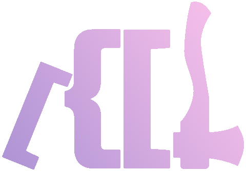

<div align="center">
    
    <p>✨ <b>json-schema-library</b> ✨</p>
    <div><a href="#overview"><b>Overview</b></a> · <a href="#schemanode-methods"><b>Methods</b></a> · <a href="#keyword-extensions"><b>Extensions</b></a> · <a href="#draft-customization"><b>Customization</b></a> · <a href="#breaking-changes">Breaking Changes</a></div>
</div>

<div>&nbsp;</div>

> _json-schema-library_ provides tools and utilities for working with JSON Schema - enabling creation, validation, and schema exploration. Unlike most validators and editors, which hide the inner workings, this library is designed for developers building custom tools around JSON Schema. It runs in both Node and browser environments, prioritizing flexibility and extensibility over minimal memory footprint or raw performance.

[](https://github.com/sagold/json-schema-library/actions/workflows/ci.yaml) [](https://github.com/sagold/json-schema-library/actions/workflows/ci.yaml) 

**Quick start**

`npm install json-schema-library`

_json-schema-library_ exposes a function `compileSchema` to compile a JSON Schema to a `SchemaNode`, which offers a common set of actions working on the specified _json-schema_:

```ts
import { compileSchema, SchemaNode } from "json-schema-library";
import myJsonSchema from "./myJsonSchema.json";
import myData from "./myData.json";

const schema: SchemaNode = compileSchema(myJsonSchema);
// validate data and collect errors if invalid
const { valid, errors } = schema.validate(myData);
// create data which validates to the compiled JSON Schema
const defaultData = schema.getTemplate();
// access a subschema at a specific JSON Pointer location
const { node, error } = schema.getSchema("#/image/title");
node && console.log(node.schema);
```

Per default, `compileSchema` uses the draft-version referenced in `$schema` for _cross-draft_ support. In case $schema is omitted or invalid the latest schema (draft-2020-12) will be used. Customizing draft selection is documented in [draft customization](#draft-customization).

```ts
const schemaNode = compileSchema({ $schema: "draft-07" });
console.log(schemaNode.getDraftVersion()); // draft-07
```

## Overview

### compileSchema

Use `compileSchema` once for a JSON Schema to convert it to a compiled tree of `SchemaNodes`. From there on you will be working on individual nodes. Besides a _json-schema_, `compileSchema` takes an options-object to modify some aspects creating the `SchemaNodes`:

```ts
type CompileOptions = {
    // set of drafts to use
    drafts: Draft[];
    // a context to share
    remote: SchemaNode;
    // if format-validations should create errors. Defaults to true
    formatAssertion: boolean | "meta-schema";
    // default options for all calls to node.getTemplate()
    templateDefaultOptions?: TemplateOptions;
};
```

With this

```ts
import { compileSchema, draft04, draft06, draft07, draft2019, draft2020 } from "json-schema-library";

// only draft07 is used for all JSON schema
compileSchema(mySchema, { drafts: [draft07] });

// the created node will share a context with `anotherSchemaNode` enabling cross schema ref-resolution
// Note that anotherSchemaNode still uses its own drafts it was compiled with
compileSchema(mySchema, { remote: anotherSchemaNode });

// format validation is disabled
compileSchema(mySchema, { formatAssertion: false });

// for all calls to getTemplate, `addOptionalProps` is `true` per default
compileSchema(mySchema, { templateDefaultOptions: { addOptionalProps: true } });
```

Details on _drafts_ are documented in [draft customization](#draft-customization).
Details on `templateDefaultOptions` are documented in [getTemplate](#gettemplate).

### SchemaNode

`compileSchema` creates a tree of nodes with a node for each sub-schema. Each node exposes the same methods, for example:

```ts
const root = compileSchema(mySchema);
const rootData = root.getTemplate();
const { node: titleNode } = root.getSchema("#/image/title");
const titleData = titleNode?.getTemplate();
```

<details><summary>Each node has an identity</summary>

```ts
const titleNode = compileSchema(mySchema).getSchema("#/image/title");
console.log(titleNode.spointer); // #/properties/image/properties/title
console.log(titleNode.schemaId); // #/properties/image/properties/title
```

-   `spointer` refers to the path in schema and is extended by `$ref`, e.g. if image is defined on `$defs`: `#/properties/image/$ref/properties/title`
-   `schemaId` refers to the absolute path within the schema and will not change, e.g. `#/$defs/properties/title`

</details>

<details><summary>Each node has a reference to its parent node</summary>

The parent-node can be a sub-schema or intermediary node:

```ts
const root = compileSchema(mySchema);
const { node: childNode } = root.getSchema("#/image");
assert(root === childNode.parent);
```

</details>

<details><summary>All nodes share a context</summary>

> It is not advised to work on context directly, but it might be useful in some situations

A context is shared across all nodes of a schema

```ts
const root = compileSchema(mySchema);
const { node: childNode } = root.getSchema("#/image");
assert(root.context === childNode.context);
```

And some context properties are shared across all schema added as remotes. The property `rootNode` refers to the root-schema for the current node

```ts
const root = compileSchema(mySchema);
const { node: childNode } = root.getSchema("#/image");
assert(root === childNode.context.rootNode);
```

Note that rootNodes will change when working across remote schema (using $ref).

</details>

### Draft Support

_json-schema-library_ fully supports all core features of draft versions draft-04, draft-06, draft-07, draft-2019-09 and draft2020-12. Additionally, most format-validations are supported per default besides the listed format below. You can always override or extend format validation as is documented in [draft customization](#draft-customization).

<details><summary>Overview draft support</summary>

Draft support is defined by running a validator against the official [json-schema-test-suite](https://github.com/json-schema-org/JSON-Schema-Test-Suite).

-   Test results for _json-schema-library_ can be inspected in [github actions](https://github.com/sagold/json-schema-library/actions/workflows/ci.yaml)
-   A comparison to other validators is listed on [json-schema-benchmark](https://github.com/sagold/json-schema-benchmark)

Please note that these benchmarks refer to validation only. _json-schema-library_ offers tooling outside of validation and strives to be as spec-compliant as possible.

</details>

<details><summary>Overview format validation support</summary>

-   **`❌ supported formats`** iri, iri-reference, idn-hostname
-   **`✅ supported formats`**: date, date-time, date, duration, ecmascript-regex, email, hostname, idn-email, ipv4, ipv6, json-pointer, regex, relative-json-pointer, time, unknown, uri-reference, uri-template, uri, uuid

</details>

## SchemaNode methods

[**validate**](#validate) · [**validateAsync**](#validateasync) · [**getTemplate**](#gettemplate) · [**getSchema**](#getschema) · [**reduce**](#reduce) · [**get**](#get) · [**each**](#each) · [**eachSchema**](#eachschema) · [**addRemote**](#addremote) · [**compileSchema**](#compileSchema-1) · [createSchema](#createSchema) · [getChildSchemaSelection](#getchildschemaselection)

### validate

`validate` is a complete _JSON Schema validator_ for your input data. Calling _validate_ will return a list of validation errors for the passed data.

```ts
const { valid, errors } = compileSchema(myJsonSchema).validate(myData);
// { valid: boolean, errors: JsonError[] }
```

<details><summary>About type JsonError</summary>

In _json-schema-library_ all errors are in the format of a `JsonError`:

```ts
type JsonError = {
    type: "error";
    name: string;
    code: string;
    message: string;
    data?: { [p: string]: any };
};
```

In almost all cases, a JSON Pointer is given on _error.data.pointer_, which points to the source within data where the error occured. For more details on how to work with errors, refer to section [custom errors](#extending-a-draft).

</details>

<details><summary>Example</summary>

```ts
const myJsonSchema: JsonSchema = {
    type: "object",
    additionalProperties: false
};

const { errors } = compileSchema(myJsonSchema).validate({ name: "my-data" });

expect(errors).to.deep.equal([
    {
        type: "error",
        name: "NoAdditionalPropertiesError",
        code: "no-additional-properties-error",
        message: "Additional property `name` in `#` is not allowed",
        data: { property: "name", properties: [], pointer: "#" }
    }
]);
```

</details>

### validateAsync

Per default all _json-schema-library_ validators are sync, but adding custom async validators is supported. To resolve async validators use `validateAsync`:

~~Optional support for `onError` helper, which is invoked for each error (after being resolved)~~

```ts
compileSchema(mySchema)
    .validateAsync(myData)
    .then(({ valid, error }) => console.log(errors));
```

### getTemplate

`getTemplate` creates input data from a JSON Schema that is valid to the schema. Where possible, the JSON Schema `default` property will be used to initially setup input data. Otherwise, the first values encountered (enum values, initial values, etc.) are used to build up the json-data.

```ts
const myData = compileSchema(myJsonSchema).getTemplate();
```

Additionally, you can pass input data. `getTemplate` will then complement any missing values from the schema, while keeping the initial values.

```ts
const myData = compileSchema(myJsonSchema).getTemplate({ name: "input-data" });
```

**Note** If you are using references in your schema, `getTemplate` will only resolve the first _$ref_ in each path, ensuring no infinite data structures are created. In case the limit of **1** _$ref_ resolution is too low, you can modify the value globally one by adjusting the json-schema-library settings:

```ts
const myData = compileSchema(myJsonSchema).getTemplate(inputData, { recursionLimit: 2 });
```

<details><summary>Example</summary>

```ts
import { compileSchema, JsonSchema } from 'json-schema-library';

const myJsonSchema: JsonSchema = {
  type: 'object',
  required: ['name', 'option', 'list'],
  properties: {
    name: { type: 'string' },
    option: {
      type: 'string',
      enum: ['first-option', 'second-option']
    },
    list: {
      type: 'array',
      items: {
        type: 'string',
        default: 'new item'
      },
      minItems: 1
    }
  }
};

const schemaNode = new compileSchema(myJsonSchema);
const myData = schemaNode.getTemplate();

expect(myData).to.deep.equal({
  name: ',
  option: 'first-option',
  list: ['new item']
});
```

</details>

<details><summary>Example with input data</summary>

```ts
import { compileSchema, JsonSchema } from "json-schema-library";

const myJsonSchema: JsonSchema = {
    type: "object",
    required: ["name", "option", "list"],
    properties: {
        name: { type: "string" },
        option: {
            type: "string",
            enum: ["first-option", "second-option"]
        },
        list: {
            type: "array",
            items: {
                type: "string",
                default: "new item"
            },
            minItems: 1
        }
    }
};

const jsonSchema = compileSchema(myJsonSchema);
const myData = jsonSchema.getTemplate({ name: "input-data", list: [] });

expect(myData).to.deep.equal({
    name: "input-data",
    option: "first-option",
    list: ["new item"]
});
```

</details>

<details><summary>Option: extendDefaults (default: false)</summary>

Per default, `getTemplate` does try to create data that is valid to the json-schema. Example: array-schemas with `minItems: 1` will add one item to fullfil the validation criteria. You can use the option and pass `{ extendDefaults: false }` to override this behaviour with a default value:

```ts
import { compileSchema } from "json-schema-library";

const myJsonSchema = {
    type: "array",
    default: [], // if omitted will add an array item
    items: {
        type: "string",
        enum: ["one", "two"]
    },
    minItems: 1 // usually adds an enty, but default states: []
};

const myData = compileSchema(myJsonSchema).getTemplate(undefined, { extendDefaults: false });

expect(myData).to.deep.equal([]);
```

</details>

<details><summary>Option: addOptionalProps (default: false)</summary>

`getTemplate` will only add required properties per default:

```ts
const data = compileSchema({
    required: ["title"],
    properties: {
        title: { type: "string" },
        subTitle: { type: "string", default: "sub-title" }
    }
}).getTemplate(undefined);
console.log(data); // { title: "" }
```

With `addOptionalProps:true`, `getTemplate` will also add all optional properties

```ts
const data = compileSchema({
    required: ["title"],
    properties: {
        title: { type: "string" },
        subTitle: { type: "string", default: "sub-title" }
    }
}).getTemplate(undefined, { addOptionalProps: true });
console.log(data); // { title: "", subTitle: "sub-title" }
```

</details>

<details><summary>Option: removeInvalidData (default: false)</summary>

With `removeInvalidData:true`, `getTemplate` will remove data that is invalid to the given schema;

```ts
const data = compileSchema({
    properties: { valid: { type: "string" } },
    additionalProperties: false
}).getTemplate({ valid: "stays", invalid: "removed" }, { removeInvalidData: true });
console.log(data); // { valid: "stays" }
```

`removeInvalidData:true` will _not_ remove data that is valid, but unspecified:

```ts
const data = compileSchema({
    properties: { valid: { type: "string" } },
    additionalProperties: true
}).getTemplate({ valid: "stays", invalid: "removed" }, { removeInvalidData: true });
console.log(data); // { valid: "stays", invalid: "removed" }
```

</details>

### getSchema

`getSchema` returns the JSON Schema from data location specified by a JSON Pointer. In many cases the JSON Schema can be retrieved without passing any data, but in situations where the schema is dynamic (for example in _oneOf_, _dependencies_, etc.), input-data is required or `getSchema` will return a _JsonError_ as is done when the JSON Pointer path is invalid.

```ts
const { node, error } = compileSchema(mySchema).getSchema("/list/1/name", myData);
if (node) console.log(node.schema);
```

**Note** `getSchema` will return a `node=undefined` for paths that lead to valid properties, but miss a schema definition. For example:

```ts
const { node, error } = compileSchema({ type: "object" }).getSchema("/name");
console.log(node, error); // undefined, undefined
```

In case this is unwanted behaviour, use the `withSchemaWarning` option to return a json-error with code `schema-warning` instead:

```ts
const schemaNode = compileSchema({ type: "object" });
const { node, error } = schemaNode.getSchema("/name", undefined, { withSchemaWarning: true });
console.log(node, error); // undefined, { type: "error", code: "schema-warning" }
```

Or set `getSchema` to return a simple JSON Schema for the found data setting `createSchema: true`:

```ts
const schemaNode = compileSchema({ type: "object" });
const { node, error } = schemaNode.getSchema("/name", { name: 123 }, { createSchema: true });
console.log(node, error); // { type: "number" }, undefined
```

<details><summary>Example</summary>

```ts
import { compileSchema } from "json-schema-library";

const mySchema = {
    type: "object",
    properties: {
        list: {
            type: "array",
            items: {
                oneOf: [
                    {
                        type: "object",
                        required: ["name"],
                        properties: {
                            name: {
                                type: "string",
                                title: "name of item"
                            }
                        }
                    },
                    {
                        type: "object",
                        required: ["description"],
                        properties: {
                            description: {
                                type: "string",
                                title: "description of item"
                            }
                        }
                    }
                ]
            }
        }
    }
};

const { node } = compileSchema(mySchema).getSchema("/list/1", {
    list: [{ description: "..." }, { name: "my-item" }]
});

expect(node.schema).to.deep.equal({
    type: "object",
    required: ["name"],
    properties: {
        name: {
            type: "string",
            title: "name of item"
        }
    }
});
```

</details>

<details><summary>Evaluating errors</summary>

All returned json-errors have a data property with the following properties

-   `pointer` JSON Pointer to the location where the error occured. In case of omitted data, this is the last JSON Schema location that could be resolved
-   `schema` the JSON Schema of the last resolved location and the source of the error
-   `value` the data value at this location that could not be resolved

```ts
const { error } = schemaNode.getSchema("/list/1");
if (error) {
    console.log(Object.keys(error.data)); // [pointer, schema, value]
}
```

</details>

<details><summary>About JsonPointer</summary>

**[JSON Pointer](https://tools.ietf.org/html/rfc6901)** defines a string syntax for identifying a specific value within a Json document and is [supported by Json-Schema](https://json-schema.org/understanding-json-schema/structuring.html). Given a Json document, it behaves similar to a [lodash path](https://lodash.com/docs/4.17.5#get) (`a[0].b.c`), which follows JS-syntax, but instead uses `/` separators (e.g., `a/0/b/c`). In the end, you describe a path into the Json data to a specific point.

</details>

### reduce

`reduce` compiles dynamic schema-keywords of a SchemaNode according to the given data.

### get

`get` retrieves the JSON Schema of a child property or index. Using `get` it is possible to incrementally go through the data, retrieving the schema for each next item.

```ts
const mySchema = { type: "object", properties: { title: { type: "string" } } };
const root = compileSchema(mySchema);
const node = root.get("title", { title: "value" });
if (!isSchemaNode(node)) return;
console.log(node.schema);
```

<details><summary>Example</summary>

```ts
import { compileSchema, JsonSchema } from "json-schema-library";

const root = compileSchema(mySchema);
const localSchema: JsonSchema = {
    oneOf: [
        {
            type: "object",
            properties: { title: { type: "string" } }
        },
        {
            type: "object",
            properties: { title: { type: "number" } }
        }
    ]
};

const schema = root.step("title", { title: 4 })?.schema;

expect(schema).to.deep.eq({ type: "number" });
```

</details>

### each

`each` iterates over each data-item (_object_, _array_ and _value_) and emits the data-item, schema and location to a callback.

```ts
const schemaNode = compileSchema(mySchema);
const myCallback = (node: SchemaNode, value: unknown, pointer: JsonPointer) => {
    console.log(node.schema, value, pointer);
};
schemaNode.each(myData, myCallback);
```

<details><summary>Example</summary>

```ts
import { compileSchema, JsonSchema, JsonPointer } from "json-schema-library";

const mySchema: JsonSchema = {
    type: "array",
    items: [{ type: "number" }, { type: "string" }]
};

const schemaNode = compileSchema(mySchema);
const calls = [];
const myCallback = (node: SchemaNode, value: unknown, pointer: JsonPointer) => {
    calls.push({ schema: node.schema, value, pointer });
};

schemaNode.each([5, "nine"], myCallback);

expect(calls).to.deep.equal([
    { schema: mySchema, value: [5, "nine"], pointer: "#" },
    { schema: { type: "number" }, value: 5, pointer: "#/0" },
    { schema: { type: "string" }, value: "nine", pointer: "#/1" }
]);
```

</details>

### eachSchema

`eachSchema` emits each sub-schema definition to a callback. A sub-schema is any schema-definition like in `properties["property"]`, `anyOf[1]`, `contains`, `$defs["name"]`, etc.

```ts
const myCallback = (node: SchemaNode) => {
    console.log(node.spointer, node.schema);
};
compileSchema(mySchema).eachSchema(myCallback);
```

<details><summary>Example</summary>

```ts
import { compileSchema, JsonSchema, SchemaNode } from "json-schema-library";

const mySchema: JsonSchema = {
    type: "array",
    items: {
        oneOf: [{ type: "number" }, { $ref: "#/$defs/value" }]
    },
    $defs: {
        value: { type: "string" },
        object: { type: "object" }
    }
};

const calls = [];
const myCallback = (node: SchemaNode) => {
    calls.push(node.schema);
};
compileSchema(mySchema).eachSchema(myCallback);

expect(calls).to.deep.equal([
    mySchema,
    { oneOf: [{ type: "number" }, { $ref: "#/$defs/value" }] },
    { type: "number" },
    { $ref: "#/$defs/value" },
    { type: "string" },
    { type: "object" }
]);
```

</details>

### getChildSchemaSelection

`getChildSchemaSelection` returns a list of available sub-schemas for the given property. In many cases, a single schema will be returned. For _oneOf_-schemas, a list of possible options is returned. This helper always returns a list of schemas.

```ts
const schemaNode = compileSchema(mySchema);
const schemas: SchemaNode[] = schemaNode.getChildSchemaSelection("content");
```

<details><summary>Example</summary>

```ts
import { compileSchema, JsonSchema } from "json-schema-library";

const jsonSchema = compileSchema({
    type: "object",
    properties: {
        content: {
            oneOf: [{ type: "string" }, { type: "number" }]
        }
    }
});

const childNodes: JsonSchema[] = jsonSchema.getChildSchemaSelection("content");

expect(childNodes.map((n) => n.schema)).to.deep.equal([{ type: "string" }, { type: "number" }]);
```

</details>

### addRemote

`addRemote` lets you add additional schemas that can be referenced by an URL using `$ref`. Use this to combine multiple schemas without changing the actual schema.

Each schemas is referenced by their unique `$id` (since draft-06, previously `id`). Usually an `$id` is specified as an url, for example `https://mydomain.com/schema/schema-name` or with a file extension like `https://mydomain.com/schema/schema-name.json`. ~~At least in _json-schema-library_ you can use any name, just ensure the `$id` is unique across all schemas.~

On a compiled schema

```ts
const schemaNode = compileSchema({
    $id: "https://sagold.com/local",
    type: "object",
    required: ["character"],
    properties: {
        character: {
            $ref: "https://sagold.com/remote"
        }
    }
});
```

use the exposed method `addRemote` to add a remote schema for $ref-resolution:

```ts
schemaNode.addRemote("https://sagold.com/remote", {
    $id: "https://sagold.com/remote",
    title: "A character",
    type: "string",
    minLength: 1,
    maxLength: 1
});
```

**Note** the given _url_ and `$id` on the root schema should match. If `$id` is omitted it will be added from the passed url.

To access the remote schema, add a $ref within your local schema and the remote schema will be resolved automatically:

```ts
schemaNode.validate({ character: "AB" }); // maxLength error
schemaNode.getTemplate({}); // { character: "A" } - default value resolved
// returns remote schema (from compiled local schema):
schemaNode.getRef("https://sagold.com/remote");
```

**Note** the support for $ref resolution has additional complexities, if you add nested $ids to you schema. Here, json-schema-library has only partial support ([@see integration test result](https://github.com/sagold/json-schema-library/actions/runs/4037856805/jobs/6941448741)). Thus, it is recommended to omit the features of changing scopes by nested $ids. For more details, see [json-schema.org: Structuring a complex schema](https://json-schema.org/understanding-json-schema/structuring.html#base-uri).

<details><summary>Adding remote schema to compileSchema</summary>

It is possible to pass remoteSchema on compileSchema by passing a SchemaNode (with all its remote schemas) in `remote`:

```ts
const remote = compileSchema({
    $id: "https://sagold.com/remote",
    $defs: {
        character: {
            title: "A character",
            type: "string",
            minLength: 1,
            maxLength: 1
        }
    }
});

const schemaNode = compileSchema({ $ref: "https://sagold.com/remote#/defs/character" }, { remote });
```

</details>

<details><summary>Access local subschemas in remote schemas</summary>

You can add a local uri reference to the remote schema by using the `#` separator. The following example resolves hte local path `/$defs/character` in the remote schema `https://sagold.com/remote` throught the combined url:
`https://sagold.com/remote#/$defs/character`

```ts
const schemaNode = compileSchema({
    $id: "https://sagold.com/local",
    $ref: "https://sagold.com/remote#/$defs/character"
});

schemaNode.addRemote("https://sagold.com/remote", {
    $defs: {
        character: {
            title: "A character",
            type: "string",
            minLength: 1,
            maxLength: 1
        }
    }
});

schemaNode.validate("AB"); // maxLength error
schemaNode.getTemplate("A"); // "A" - default value resolved
// returns remote schema (from compiled local schema):
schemaNode.getRef("https://sagold.com/remote#/$defs/character");
```

**Note** JSON Pointer are not restricted to `$defs` (definitions), but can reference any subschema. For example:

```ts
const schemaNode = compileSchema({
    $id: "https://sagold.com/local",
    $ref: "https://sagold.com/remote#/properties/character"
});

schemaNode.addRemote("https://sagold.com/remote", {
    type: "object",
    properties: {
        character: {
            title: "A character",
            type: "string",
            minLength: 1,
            maxLength: 1
        }
    }
});

schemaNode.validate("AB"); // maxLength error
schemaNode.getTemplate("A"); // "A" - default value resolved
// returns remote schema (from compiled local schema):
schemaNode.getRef("https://sagold.com/remote#/properties/character");
```

</details>

### compileSchema

`node.compileSchema` creates a new schema node in the same context as node. With this, the created node will be able to resolve local `$ref` and remote `$ref` correctly. Note, the created schema will not be part of (linked) from any nodes in the schema-tree.

```ts
const someNode = node.compileSchema({ prefixItems: [{ type: "string" }, { $ref: "#/$defs/string" }] });
```

### createSchema

`createSchema` returns a simple JSON Schema for the input data.

```ts
const schemaNode = compileSchema(mySchema);
const schema: JsonSchema = schemaNode.createSchema({ title: "initial value" });
console.log(schema); // { type: "string" }
```

## Keyword extensions

### oneOfProperty

For `oneOf` resolution, JSON Schema states that data is valid if it validates against exactly one of those sub-schemas. In some scenarios this is unwanted behaviour, as the actual `oneOf` schema is known and only validation errors of this exact sub-schema should be returned.

For an explicit `oneOf` resolution, the JSON Schema may be extended by a property `oneOfProperty`. This will always associate an entry with a matching value (instead of schema validation) and return only this schema or validation errors, depending on the current task. For example:

```ts
const schema = {
    oneOfProperty: "id",
    oneOf: [
        {
            type: "object",
            properties: { id: { const: "1" }, title: { type: "number" } }
        },
        {
            type: "object",
            properties: { id: { const: "2" }, title: { type: "number" } }
        },
        {
            type: "object",
            properties: { id: { const: "3" }, title: { type: "number" } }
        }
    ]
};

const resolvedNode = compileSchema(schema).reduce({ id: "2", title: "not a number" });

// will always return (even if invalid)
expect(resolvedNode?.schema).to.deep.eq({
    type: "object",
    properties: { id: { const: "2" }, title: { type: "number" } }
});
```

## Draft Customization

[**Extending a Draft**](#extending-a-draft) · [**Keyword**](#Keyword)

_json-schema-library_ uses a list of drafts to support different draft-versions and cross-draft support. A draft is exported for each json-schema-draft:

```ts
import { draft04, draft06, draft07, draft2019, draft2020 } from "json-schema-library";
```

A `Draft` is an object with the following **main** properties

```ts
type Draft = {
    $schemaRegEx: string;
    version: DraftVersion;
    keywords: Keyword[];
    methods: {};
};
```

**$schemaRegEx**

`$schemaRegEx` is a regex string, e.g. `"draft[-/]2020-12"` to test if the draft should be used for a given JSON Schema with a defined `$schema-url`. So the given draft will match a `$schema: "https://json-schema.org/draft/2020-12/schema"`. `CompileSchema` receives a list of drafts, that will be tested from left to right and the first match will be returned:

```ts
compileSchema(schema, { drafts: [draft04, draft07, draft2020] });
```

Note that failing to identify a draft, the last draft in the list will used. Using only one draft ignores the $schemaRegEx so you can simply write: `$schema: ""`

**version**

The version refers to a json-schema-draft version and is currently only used for logging

**keywords**

_keywords_ is a list of `Keyword` that represent JSON Schema keywords like `$ref`, `oneOf`, etc that hold metadata and their implementation. Each _keyword_ can be replaced, removed or new keywords introduced. Details on customizing keywords are documented in [Keyword](#keyword).

**methods**

Methods are a set of SchemaNode functions that differ between draft versions and have to be specified on a draft. This methods are only executed by methods in `SchemaNode`. Customizing your draft, these functions can also be overriden

<details><summary>Current methods</summary>

```ts
createSchema: typeof createSchema;
getChildSchemaSelection: typeof getChildSchemaSelection;
getTemplate: typeof getTemplate;
each: typeof each;
```

</details>

### Extending a Draft

_json-schema-library_ exposes a utility to simplify draft extension. `extendDraft` will create a new, modified draft:

```ts
import { extendDraft, draft2020, oneOfFuzzyKeyword, createCustomError, render, ErrorData } from "json-schema-library";

const myDraft = extendDraft(draft2020, {
    // match all $schema
    $schemaRegEx: "",
    // Keyword registers to "oneOf", replacing existing keyword
    keywords: [oneOfFuzzyKeyword],
    formats: {
        // add new `"format": "test"` which returns an error when the value is test
        test: ({ data, node, pointer }) => {
            if (data === "test") {
                return node.createError("testError", {
                    schema: node.schema,
                    pointer: pointer,
                    value: data,
                    customValue: "test"
                });
            }
        }
    },
    errors: {
        // add new custom error testError
        testError: "Test error for value {{value}} - {{customValue}}",
        // overwrite existing error message
        MaxLengthError: "Too many characters",
        // add dynamic error
        MinLengthError: (data: ErrorData) => {
            if (data.minLength === 1) {
                return {
                    type: "error",
                    name: "MinLengthOneError",
                    code: dashCase("MinLengthOneError"),
                    message: "Input is required",
                    data
                };
            }
            return {
                type: "error",
                name: "MinLengthError",
                code: dashCase("MinLengthError"),
                message: render("Value in `{{pointer}}` is `{{length}}`, but should be `{{minimum}}` at minimum", data),
                data
            };
        }
    }
});
```

<details><summary>About fuzzy oneOf resolution</summary>

The default JSON Schema behaviour for `oneOf` resolution is to validate all contained _oneOf_-schemas and return the one schema that validates against the given input data. If no item validates completely an error returned, containing all validation errors of all schemas. When you are interested in the actual error (rather than simply determining “Is the data is valid or not?”), this is behaviour is not very helpful as the result is hard to read.

`json-schema-library` exposes a method `oneOfFuzzyKeyword`, which will return a single schema in cases where no valid schema could be resolved. `oneOfFuzzyKeyword` uses a simple scoring mechanism to return the best fitting schema for the given input data. Thus, `oneOfFuzzyKeyword` may return schemas that do not validate a given input data.

</details>

### Keyword

`Keywords` hold the main logic for JSON Schema functionality. Each `Keyword` corresponds to a JSON Schema keyword like `properties`, `prefixItems`, `oneOf`, etc and offers implementations to `parse`, `validate`, `resolve` and `reduce`. Note that support for each implementation is optional, dependending on the feature requirements. The main properties of a `Keyword`:

-   a `Keyword` is only processed if the specified `keyword` is available as property on the JSON Schema
-   an optional `order` property may be added as order of keyword execution is sometimes important (`additionalItems` last, `$ref` evaluation first)
-   the list of keywords is unique by property-value `keyword`
-   for a given function `addX`, a function `X` must be present

```ts
type Keyword = {
    id: string;
    keyword: string;
    order?: number;
    parse?: (node: SchemaNode) => void;
    addResolve?: (node: SchemaNode) => boolean;
    resolve?: JsonSchemaResolver;
    addValidate?: (node: SchemaNode) => boolean;
    validate?: JsonSchemaValidator;
    addReduce?: (node: SchemaNode) => boolean;
    reduce?: JsonSchemaReducer;
};
```

For examples on keyword implementations refer to [./src/keywords](./src/keywords).

**parse**

`parse` will be executed on compile time, usually to add a compiled sub-schema on the parent-node.

<details><summary>Example of keyword using parse</summary>

```ts
export const notKeyword: Keyword = {
    id: "not",
    keyword: "not",
    parse: parseNot
};

export function parseNot(node: SchemaNode) {
    const { schema, spointer, schemaId } = node;
    if (schema.not != null) {
        node.not = node.compileSchema(schema.not, `${spointer}/not`, `${schemaId}/not`);
    }
}
```

</details>

**resolve**

A resolver returns a child-schema for a property-key, item-index or undefined if the key does not apply.

<details><summary>Example of keyword using resolve</summary>

```ts
export const propertiesKeyword: Keyword = {
    id: "property",
    keyword: "properties",
    parse: parseProperties,
    addResolve: (node: SchemaNode) => node.properties != null,
    resolve: propertyResolver
};

function propertyResolver({ node, key }: JsonSchemaResolverParams) {
    return node.properties?.[key];
}
```

</details>

**reduce**

A reducer replaces the JSON Schema keyword to a simple, static JSON Schema based on the current data

<details><summary>Example of keyword using reduce</summary>

```ts
export const typeKeyword: Keyword = {
    id: "type",
    keyword: "type",
    addReduce: (node) => Array.isArray(node.schema.type),
    reduce: reduceType,
    addValidate: ({ schema }) => schema.type != null,
    validate: validateType
};

function reduceType({ node, pointer, data }: JsonSchemaReducerParams): undefined | SchemaNode {
    const dataType = getJsonSchemaType(data, node.schema.type);
    if (dataType !== "undefined" && Array.isArray(node.schema.type) && node.schema.type.includes(dataType)) {
        return node.compileSchema({ ...node.schema, pointer, type: dataType }, node.spointer);
    }
    return undefined;
}
```

</details>

## Breaking Changes

### v10.0.0

With version `v10.0.0` _draft 2019-09_ is supported and can be used with `import { Draft2019 } from "json-schema-library";` Note that older drafts are now resolving all official test cases, especially remaining ref-resolution issues.

**breaking changes**:

-   removed `templateDefaultOptions` from global settings-object. Instead configure getTemplate per draft instead on `draft.templateDefaultOptions`

```ts
new Draft2019(schema, {
    templateDefaultOptions: {
        addOptionalProps: false,
        removeInvalidData: false,
        extendDefaults: true
    })
});
```

_Draft 2019-09_ requires collection of previous resolved sub-schemas. Thus, an additional type `SchemaNode` had to be introduced, which is used in almost all draft methods defined for draft-configs. The api in draft-instances mostly stayed the same with the following exceptions:

-   `step` and resolvers work on and return a `schemaNode`, containing the requested schema

A control property `__oneOfIndex: number` is added to resolved oneOf-schema to retrieve the source of the original schema. If this unwanted behaviour you can disabled this behaviour by:

```ts
import { settings } from "json-schema-library";
settings.EXPOSE_ONE_OF_INDEX = false;
```

### v9.0.0

**breaking changes**:

-   _getSchema_ signature changed in favour of an options object. Instead of `draft.getSchema(pointer, data)` arguments have to be passed as an object `draft.getSchema({ pointer, data })`. This removes setting unwanted optional arguments and keeps the api more stable in the future (e.g. `withSchemaWarning` option)
-   _JsonError_ now must expose `pointer`, `schema` and `value` consistently on data property

**updates**

-   _getSchema_ consistently returns errors and can return errors for empty schema using `withSchemaWarning` option

### v8.0.0

With version `v8.0.0`, _getTemplate_ was improved to better support optional properties and utilize existing core logic, making it more reliable. Breaking changes:

-   Renamed `JSONError` to `JsonError` and `JSONSchema` to `JsonSchema`
-   `getTemplate` only adds required properties. Behaviour can be changed by [getTemplate default options](#gettemplate-default-options)
-   Internal schema property `oneOfSchema` has been replaced by `schema.getOneOfOrigin()`
-   Changed `unique-items-error` to point to error for duplicated item and changed data-properties
-   Removed `SchemaService` as it was no longer used nor tested

<details><summary>Exposed new helper functions</summary>

-   `mergeSchema` - Merges to two json schema
-   `reduceSchema` - Reduce schema by merging dynamic constructs into a static json schema omitting those properties
-   `isDynamicSchema` - Returns true if the passed schema contains dynamic properties (_if_, _dependencies_, _allOf_, etc)
-   `resolveDynamicSchema` - Resolves all dynamic schema definitions for the given input data and returns the resulting JSON Schema without any dynamic schema definitions.

</details>

### v7.0.0

With version `v7.0.0`, library export and Draft API has changed heavily. The API is now more consistent across draft-versions and offers a simple and consistent configuration interface for existing and custom drafts. In addition, most standalone functions are no longer exposed separately, but under its current _draftConfigs_ and mainly on each draft-instance. This will help to reduce confusion when consuming this API.

The above documentation reflects all these changes. Just reach out if you have troubles migrating to the latest version.

<details><summary>Details of breaking changes</summary>

-   replaced `Core` interface by new `Draft` interface
-   changed export of `Interface` to `Draft`
-   renamed `addSchema` to `addRemote`
-   changed API of `compileSchema` to have an additional schema-parameter for rootSchema reference
-   changed `compileSchema` and `addRemote` to work on instance state, instead of global state
-   `addRemote`, `compileSchema` now requires draft instance as first parameter
-   removed direct export of following functions: `addValidator`, `compileSchema`, `createSchemaOf`, `each`, `eachSchema`, `getChildSchemaSelection`, `getSchema`, `getTemplate`, `isValid`, `step`, `validate`. They are still accessible under the draftConfigs of each draft-version
-   changed draft version of `JsonEditor` to draft07

</details>

### v6.0.0

With version `v6.0.0` supported json schema drafts are exported directly as `Draft04`, `Draft06`, `Draft07`. Example use: `import { Draft07 } from "json-schema-library"`.

### v5.0.0

With version `v5.0.0` the API has changed to es6 modules, where there is no `default` export, only named exports. Additionally all code has been rewritten in TypeScript. When directly accessing files, switch to `dist/module/*.js`-files for plain js-modules.

### v4.0.0

With version `v4.0.0` the API has changed in order to use the defined (root) schema in draft as default where possible. This means most methods have a changed signature, where `data` is passed before an optional `schema` argument.
